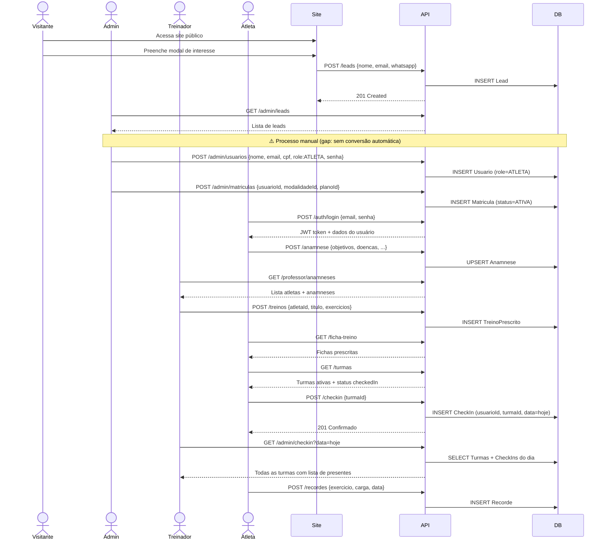
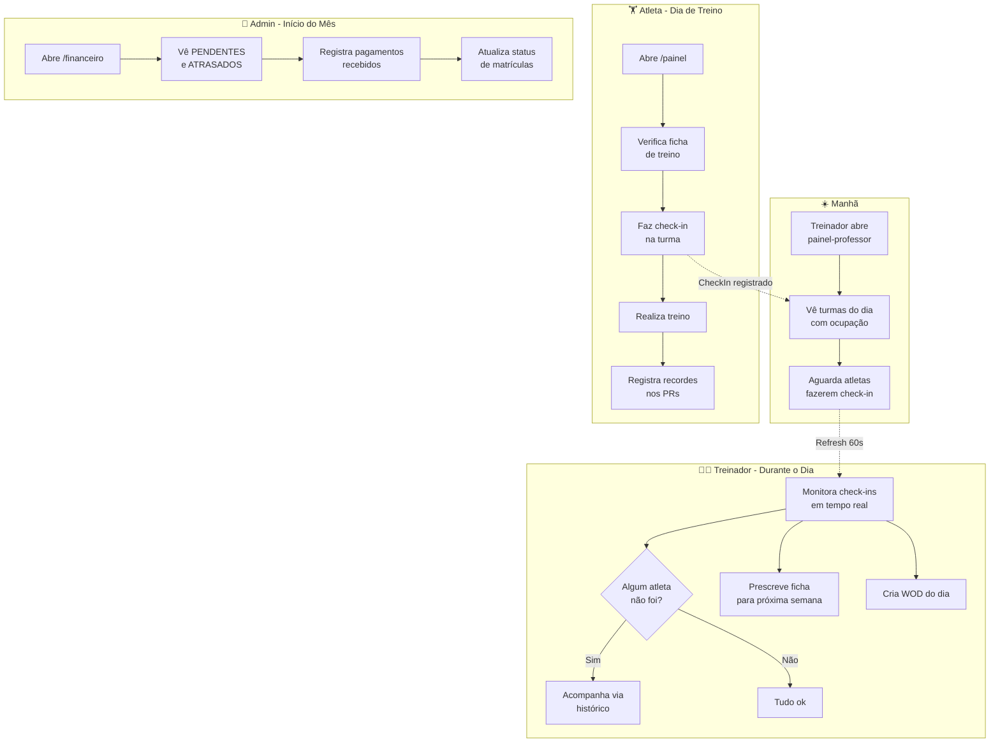
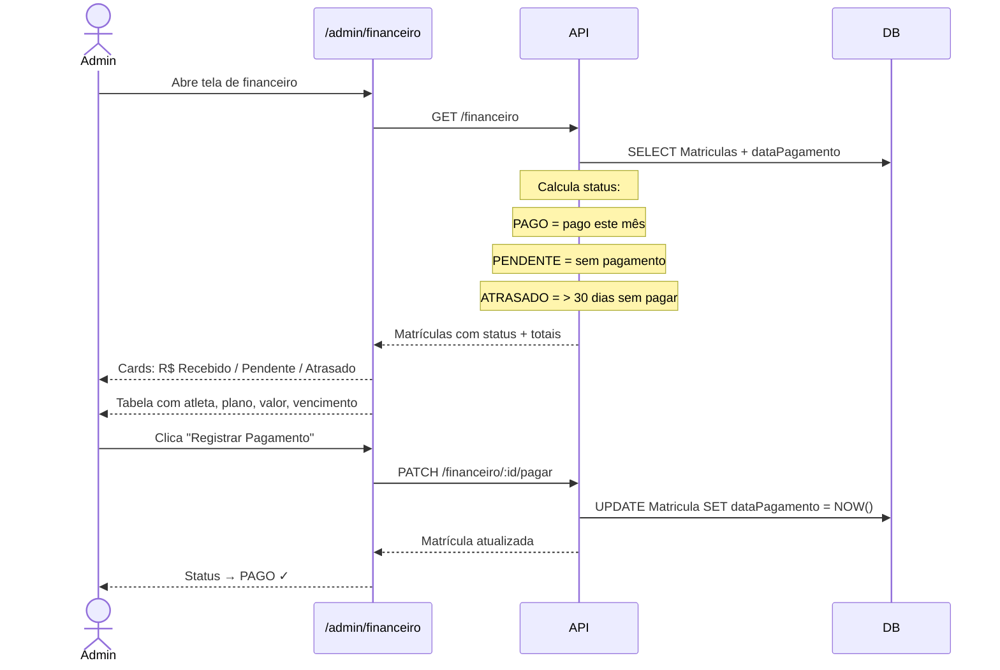
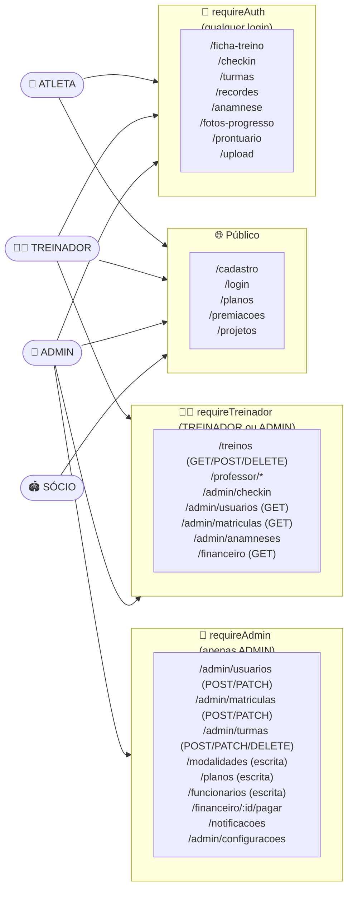

# Mapa de Uso do Sistema — Gorila Rise

> Análise completa de como cada persona usa o sistema no dia-a-dia, com gaps identificados.

---

## Personas e Roles

| Role | Acesso | funcao (especialidade) |
|------|--------|------------------------|
| `ATLETA` | `/painel` | — |
| `TREINADOR` | `/painel-professor` + `/admin` | PROFESSOR / NUTRICIONISTA / FISIOTERAPEUTA |
| `ADMIN` | `/admin` | — |
| `SOCIO_TORCEDOR` | `/painel-socio` | — |

---

## 1. ATLETA — Dia-a-dia

### Jornada de entrada (uma vez)
1. Acessa o site → clica "Entre para o Bando" → cadastro em `/cadastro`
2. Aguarda contato do treinador para definição de modalidade e plano
3. Admin cria a matrícula vinculando atleta + modalidade + plano

### Uso diário típico
```
Abre /painel → Dashboard
  → vê check-in de hoje (fez ou não)
  → vê próximo treino prescrito
  → vê último recorde pessoal

Check-in (aba)
  → vê turmas disponíveis (horário, código, vagas restantes)
  → confirma presença até 2h antes
  → pode cancelar com mínimo 2h de antecedência

Ficha de Treino (aba)
  → lê ficha prescrita pelo treinador (exercícios, séries, cargas)
  → consulta durante o treino

Recordes (aba)
  → após o treino registra novo PR (exercício, carga, data)
  → pode deletar recordes antigos
```

### Todas as ações disponíveis
| Área | Criar | Ver | Editar | Deletar |
|------|-------|-----|--------|---------|
| Foto de perfil | ✓ upload | ✓ | ✓ | — |
| Cartão associado / QR | — | ✓ | — | — |
| Ficha de treino | — | ✓ | — | — |
| Anamnese | ✓ | ✓ | ✓ (upsert) | — |
| Check-in | ✓ | ✓ | — | ✓ (cancelar) |
| Recordes pessoais | ✓ | ✓ | — | ✓ |
| Prontuário (biometria + docs) | ✓ | ✓ | ✓ | — |
| Foto inicial / 24 semanas | ✓ upload | ✓ | — | — |
| Cronômetro | — | ✓ local | — | — |

### Gaps do atleta
- ❌ Sem visualização de WOD do dia (apenas ficha individual prescrita)
- ❌ Sem notificações recebidas (model existe, entrega não implementada)
- ❌ Sem histórico de check-ins de dias anteriores

---

## 2. TREINADOR — Dia-a-dia

### Acesso
- `/painel-professor` — painel de trabalho principal
- `/admin` — acesso completo ao back-office (sem restrições por funcao)

### Uso diário típico
```
Manhã → /painel-professor → Dashboard
  → conta atletas vinculados
  → vê check-ins confirmados por turma (barra de ocupação, vagas abertas)
  → vê treinos prescritos esta semana

Check-in / Turmas (aba)
  → monitora presença em tempo real (auto-refresh 60s)
  → cada card de turma mostra: X/capacidade confirmados, lista de nomes, vagas
  → pode trocar data para ver presença histórica
  → botão "↻ Atualizar" para refresh manual

Prescrever Treino → Fichas Individuais
  → seleciona atleta no dropdown
  → escreve título e exercícios (campo livre/texto)
  → atleta vê imediatamente no próprio painel

Prescrever Treino → WODs
  → cria treino coletivo do dia (título, data, exercícios)
  → sistema registra autor automaticamente pelo JWT

Anamneses (aba)
  → lista atletas com indicador Preenchida / Pendente
  → abre modal com ficha completa para embasar prescrições

Desempenho (aba)
  → seleciona atleta → vê histórico de recordes pessoais

Calculadora de Dieta (aba — só PROFESSOR e NUTRICIONISTA)
  → ferramenta local de cálculo nutricional
```

### Todas as ações disponíveis
| Área | Criar | Ver | Editar | Deletar |
|------|-------|-----|--------|---------|
| Ficha de treino (prescrita) | ✓ | ✓ | — | ✓ |
| WOD | ✓ | ✓ | — | ✓ |
| Check-in por turma | — | ✓ | — | — |
| Anamnese dos atletas | — | ✓ | — | — |
| Recordes dos atletas | — | ✓ | — | — |
| Calculadora de dieta | — | ✓ (PROF/NUTRI) | — | — |

### Gaps do treinador
- ❌ Sem edição de fichas de treino (apenas criar/deletar)
- ❌ Sem vínculo FK treinador↔atleta no banco (qualquer treinador vê todos os atletas)
- ❌ Sem envio de notificações para atletas
- ❌ Sem acesso às fotos de progresso dos atletas
- ❌ Acesso ao admin não é granular (TREINADOR vê e edita tudo no admin)

---

## 3. ADMIN — Dia-a-dia

### Acesso: `/admin` com menu lateral completo

### Fluxo operacional completo

**PESSOAS**
```
Leads (/admin/leads)
  → recebe leads capturados pelo site (nome, email, WhatsApp, origem)
  → decide converter: cria usuario MANUALMENTE em /admin/usuarios
    ⚠️ GAP: sem botão "Converter em Atleta" automático

Usuários (/admin/usuarios)
  → cria usuário (nome, email, CPF, telefone, cidade, role, senha)
  → edita dados, troca role (ATLETA / TREINADOR / ADMIN)
  → define funcao para TREINADORs (PROFESSOR / NUTRICIONISTA / FISIOTERAPEUTA)
  → ativa / inativa conta
  → redefine senha

Funcionários (/admin/funcionarios)
  → cadastra funcionário (nome, email, CREF/CRN, função)
  → vincula funcionário a conta de usuário (role TREINADOR)
  → ativa / inativa
```

**OPERAÇÃO**
```
Modalidades → CRUD
Planos → CRUD (nome, valor, descrição)

Matrículas (/admin/matriculas)
  → cria matrícula: atleta + modalidade + plano + status inicial
  → alterna status: ATIVA / INATIVA / PENDENTE

Turmas (/admin/turmas)
  → cria turma (código único, horário, dias da semana, capacidade, faixa etária)
  → ativa / desativa
  → edita capacidade e horário

Treinos (/admin/treinos)
  → mesmas ações do treinador: WODs + Fichas individuais

Check-in (/admin/checkin)
  → visualiza presença por data, agrupada por turma
  → vê quem confirmou, barra de ocupação, vagas em aberto
```

**FINANCEIRO & COMUNICAÇÃO**
```
Financeiro (/admin/financeiro)
  → lista matrículas com status PAGO / PENDENTE / ATRASADO
  → cards de totais: Recebido, Pendente, Atrasado
  → clica "Registrar Pagamento" → define dataPagamento = hoje

Notificações (/admin/notificacoes)
  → cria notificação (título, corpo, tipo: AVISO / EVENTO / COMUNICADO)
  ⚠️ GAP: notificação não é entregue ao atleta (sem push / email / in-app)
```

**CLUBE**
```
Premiações → registra com athletaNome (campo livre), data, imagem → público em /premiacoes
Patrocinadores → CRUD com categoria (PLATINA/OURO/PRATA/BRONZE)
Projetos Sociais → CRUD com slug auto-gerado → público em /anjos-do-esporte
Documentos → CRUD de documentos oficiais (PDF)
```

**SISTEMA**
```
Configurações (/admin/configuracoes)
  → endereço do clube, contatos, horários de funcionamento, redes sociais
```

---

## 4. SÓCIO TORCEDOR — Dia-a-dia

### Acesso: `/painel-socio`

| Área | Status |
|------|--------|
| Dashboard (pontos, ranking, jogos) | ⚠️ Dados mockados — sem backend |
| Carteira digital com QR Code | ✓ Funcional |
| Benefícios por categoria (OURO/PRATA/BRONZE) | ⚠️ Conteúdo fixo no código |
| Ingressos | ❌ Vazio — sem jogos/eventos cadastrados |
| Ranking | ❌ Vazio — sistema de pontos não implementado |

### Gaps do sócio torcedor
- ❌ Praticamente toda a tela é mockada
- ❌ Sistema de pontos, ranking e ingressos sem qualquer backend

---

## Fluxos Transversais

### Jornada Completa de um Atleta (do zero até treinar)
```
1.  Site público → modal de interesse → Lead (POST /leads)
2.  Admin vê lead em /admin/leads
3.  Admin cria Usuario em /admin/usuarios  ← GAP: processo manual
4.  Admin cria Matrícula (Usuario + Modalidade + Plano)
5.  Admin cria Turma com horário e capacidade
6.  Atleta faz login → preenche Anamnese
7.  Treinador lê Anamnese → prescreve Ficha de Treino
8.  Atleta faz Check-in na turma do dia
9.  Atleta realiza treino → registra Recorde
10. Atleta faz upload de Foto Inicial
11. Admin registra pagamento mensal em /admin/financeiro
```

### Fluxo de Pagamento
```
Matrícula criada (status ATIVA ou PENDENTE)
  ↓
Admin vê em /financeiro — status calculado:
  PAGO     = dataPagamento existe e é no mês atual
  PENDENTE = dataPagamento nulo
  ATRASADO = sem pagamento por mais de 30 dias
  ↓
Admin clica "Registrar Pagamento"
  → PATCH /financeiro/:id/pagar → dataPagamento = now()
```

---

## Gaps Globais — Resumo Priorizado

### Alta Impacto
| # | Gap | Contexto |
|---|-----|---------|
| 1 | **Conversão Lead→Atleta manual** | Admin cria usuário à mão sem fluxo guiado |
| 2 | **Notificações não chegam ao atleta** | Model existe, sem mecanismo de entrega |
| 3 | **WOD invisível ao atleta** | Atleta não vê WOD do dia no próprio painel |
| 4 | **Sem vínculo Treinador↔Atleta** | Qualquer treinador vê todos os atletas |

### Média Impacto
| # | Gap | Contexto |
|---|-----|---------|
| 5 | **Edição de fichas de treino** | Só criar/deletar, sem editar |
| 6 | **Histórico de check-ins do atleta** | Atleta só vê o dia corrente |
| 7 | **Fotos de progresso no admin/treinador** | Sem visibilidade para quem prescreve |
| 8 | **Premiacao sem FK para atleta** | athletaNome é string livre |

### Baixo Impacto
| # | Gap | Contexto |
|---|-----|---------|
| 9 | **Sócio torcedor sem backend real** | Pontos, ranking, ingressos mockados |
| 10 | **Admin não edita anamnese** | Leitura apenas |
| 11 | **Notificação sem destinatário específico** | Sem model de destinatário por usuário |

---

## Rotas Backend — Visão Resumida por Guardião

| Guardião | Prefixos | Total de rotas |
|----------|----------|----------------|
| Público | /auth/check, /auth/cadastro, /auth/login, /modalidades (GET), /planos (GET), /leads (POST), /projetos (GET), /documentos (GET), /configuracoes (GET), /premiacoes (GET), /patrocinadores (GET), /health | ~12 |
| requireAuth | /auth/me, /turmas, /checkin, /recordes, /anamnese, /fotos-progresso, /prontuario, /upload, /ficha-treino | ~11 |
| requireTreinador | /admin/stats, /admin/usuarios (GET), /admin/matriculas (GET), /admin/leads, /admin/anamneses, /admin/turmas (GET), /admin/checkin, /professor/*, /treinos/*, /financeiro (GET), /funcionarios (GET) | ~15 |
| requireAdmin | /admin/usuarios (POST/PATCH), /admin/matriculas (POST/PATCH), /admin/turmas (POST/PATCH/DELETE), /modalidades (POST/PATCH/DELETE), /planos (POST/PATCH/DELETE), /funcionarios (POST/PATCH/DELETE), /financeiro/:id/pagar, /notificacoes, /premiacoes (POST/PATCH/DELETE), /projetos (POST/PATCH/DELETE), /documentos (POST/PATCH/DELETE), /patrocinadores (POST/PATCH/DELETE), /admin/configuracoes | ~20 |

---

## Diagramas de Fluxo

### 1. Jornada Completa — Do Lead ao Atleta Ativo



---

### 2. Ciclo Operacional Diário — Visão Geral



---

### 3. Fluxo de Pagamento Mensal



---

### 4. Diagrama de Entidades e Fluxos de Dados

```mermaid
erDiagram
    USUARIO {
        int id PK
        string nome
        string email
        string cpf
        enum role "ATLETA|TREINADOR|ADMIN|SOCIO"
        enum funcao "PROFESSOR|NUTRICIONISTA|FISIOTERAPEUTA"
        bool ativo
    }
    LEAD {
        int id PK
        string nome
        string email
        string whatsapp
        string origem
    }
    MATRICULA {
        int id PK
        int usuarioId FK
        int modalidadeId FK
        int planoId FK
        enum status "ATIVA|INATIVA|PENDENTE"
        datetime dataPagamento
    }
    MODALIDADE {
        int id PK
        string nome
        string categoria
    }
    PLANO {
        int id PK
        string nome
        decimal valor
    }
    TURMA {
        int id PK
        string codigo
        string horario
        json dias
        int capacidade
        bool ativa
    }
    CHECKIN {
        int id PK
        int usuarioId FK
        int turmaId FK
        date data
    }
    TREINOPRESCRITO {
        int id PK
        int atletaId FK
        string titulo
        text exercicios
    }
    WOD {
        int id PK
        int autorId FK
        string titulo
        date data
        text exercicios
    }
    ANAMNESE {
        int id PK
        int usuarioId FK
        json objetivos
        text doencas
        bool termoAssinado
    }
    RECORDE {
        int id PK
        int usuarioId FK
        string exercicio
        string carga
    }
    FUNCIONARIO {
        int id PK
        int usuarioId FK
        string nome
        enum funcao
        string cref
    }

    USUARIO ||--o{ MATRICULA : "possui"
    USUARIO ||--o{ CHECKIN : "realiza"
    USUARIO ||--o| ANAMNESE : "preenche"
    USUARIO ||--o{ RECORDE : "registra"
    USUARIO ||--o{ TREINOPRESCRITO : "recebe"
    USUARIO ||--o{ WOD : "cria (autor)"
    USUARIO ||--o| FUNCIONARIO : "vinculado a"
    MATRICULA }o--|| MODALIDADE : "em"
    MATRICULA }o--|| PLANO : "contratado"
    CHECKIN }o--|| TURMA : "na turma"
    LEAD ..> USUARIO : "⚠️ conversão manual"
```

---

### 5. Permissões por Rota — Mapa Visual


